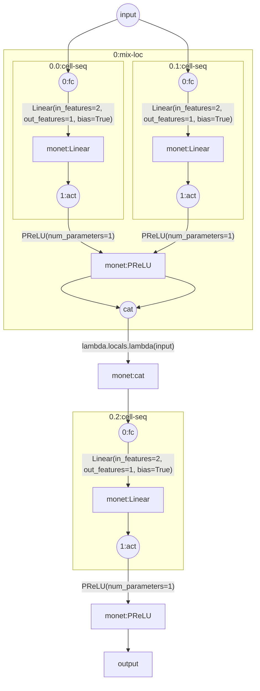
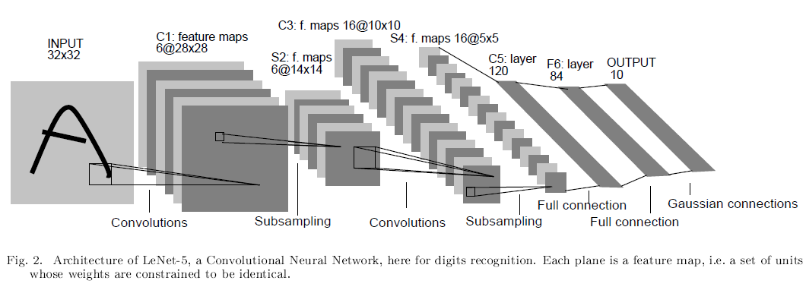

在构建一个算法流程或者神经网络时，通常显得过于臃肿和复杂；为了描述清楚其中的逻辑与结构，通常还需要配以图形来进行解构。然而，实际上这可能把简单的事情复杂化，因此本框架旨在使得算法流或AI流更简洁明了与易于搭建。

When constructing an algorithm flow or neural network, it often appears too cumbersome and complex; In order to describe the logic and structure clearly, it is usually necessary to use graphics for deconstruction. However, in reality, this may complicate simple things, so this framework aims to make algorithm or AI flows more concise, clear, and easy to build.

# Core features：Construct function streams like writing formulas

- 通过*和+两种运算符的重载，优化函数的连续执行；
- 通过形式化字典，优化函数的参数传递；
- 对pytorch和sklearn的常用函数进行了封装；
- Optimize the continuous execution of functions by overloading the * and+operators;
- Optimize the parameter transfer of functions through formal dictionaries;
- Encapsulated the commonly used functions of pytorch and sklearn.

# FunctionModel API

## Basic usage

基础用法为：<初始化算子><执行算符><执行对象>

- 初始化算子：通过fn(operator)完成，operator默认为空
- 执行算符：*表示迭代模式，+表示添加模式
- 执行对象：单个对象或者对象列表(与operator迭代)

| Write                        | Code                                                                               | Function                                                                                                                                                                                                                             |
| :--------------------------- | ---------------------------------------------------------------------------------- | ------------------------------------------------------------------------------------------------------------------------------------------------------------------------------------------------------------------------------------ |
| $F=F1F2···Fn$           | F = fn()*F1\*F2\*...*Fn                                                            | 定义一个顺序迭代输出的函数组，F(x)等价于：Define a set of sequentially executed functions, F(x) equivalent to:F(x)=Fn(...F2(F1(x)))                                                                                                  |
| $F=(F1,F2,···,Fn)$      | F = fn()*(F1,F2,...,Fn)                                                            | 定义一个顺序拼接输出的函数组，F(x)等价于：F(x)=( F1(x), F2(x), ..., Fn(x) )                                                                                                                                                          |
| $F=F1+F2+...+Fn$           | F = fn()+F1+F2+...+Fn                                                              | 定义一个顺序添加输出的函数组，F(x)等价于：F(x)=( *F1(x), *F2(x), ..., *Fn(x) )                                                                                                                                                       |
|                              | **fn()中可以添加算子:**'+' = 'add' = operator.add'×' = 'mul' = operator.mul | **算子为字符串：'+'/'×'或者[`operator`](https://docs.python.org/zh-cn/3/library/operator.html#module-operator "operator: Functions corresponding to the standard operators.")库中的函数算子为函数名：该函数的输入必须是两个参数** |
| $F=+(F1,F2,···,Fn)$     | F = fn('+')\*(F1,F2,...,Fn)                                                        | 定义一个顺序求和输出的函数组，F(x)等价于：F(x)=F1(x)+F2(x)+...+Fn(x)                                                                                                                                                                 |
| $F=×(F1,F2,···,Fn)$    | F = fn('×')\*(F1,F2,...,Fn)                                                       | 定义一个顺序求积输出的函数组，F(x)等价于：F(x)=F1(x)×F2(x)×...×Fn(x)                                                                                                                                                              |
| $F = ＋( F1+F2+···+Fn)$ | F = fn('+')+(F1,F2,...,Fn)                                                         | 定义一个顺序求和输出的函数组，F(x)等价于：y = 0for i in (\*F1(x),\*F2(x),...,\*Fn(x)):    y = operator.add( y, i)                                                                                                                    |
| $F = ×( F1+F2+···+Fn)$ | F = fn('×')+(F1,F2,...,Fn)                                                        | 定义一个顺序求和输出的函数组，F(x)等价于：y = 1for i in (\*F1(x),\*F2(x),...,\*Fn(x)):    y = operator.mul( y, i)                                                                                                                    |

## Function Extend

为了使算法或模型流更简洁，我们可以对每个组件定义缩写变量名，但是这无法简化参数的传递过程；为此我们通过了对象可扩展能力，实现通过字符串传递缩写的组件及其重要参数。

To make the algorithm or model flow more concise, we can define abbreviated variable names for each component, but this cannot simplify the process of parameter transfer; For this purpose, we have achieved the ability of object scalability by passing abbreviations and their important parameters through strings.

标准扩展中：执行对象可以是 <字符串形式执行对象> ，且可以在字符串中传递参数，通过形式字典完成

形式字典定义方法：`"<name><num>`.``<str arg>_<value arg>" : lambda  *x,<strarg>,<valuearg> : <被形式化函数>(<传入参数>)``

形式字典传参方法：`"<name><num>`.``<str arg>_<value arg>"``

当返回值为None时，返回x; 当不为None时，返回实际值

* 该用法默认使用默认定义的形式字典，支持传入自定义的形式字典
* 扩展需返回一个实例化的对象或可执行的函数

```python
fn_extend={
    "log": lambda *x,file='result':
        print(x,file=open(f'{file}.log','a+')),
    "m_abs": lambda *x,m_func='max':
        eval(m_func)((abs(i) for i in x))
}

F=fn()*"log"
a = F(1,2,3,{'a':2})
print(a)
F = fn()*"m_abs"
a = F(1,-2,-3,m_func='max')
print(a)

>>None
3
```

```output
Language hasn't been implemented yet
```

```rust
input = '''```mermaid
graph TB
start((input))'''

┗━="subgraph"
```

```json
(input) seq
 ┗━ (0:mix) loc
     ┗━ (0:cell) seq
         -> (0:fc): @monet:Linear(in_features=2, out_features=1, bias=True)^(*args, **kwargs){} *id:1345752574720
         -> (1:act): @monet:PReLU(num_parameters=1)^(*args, **kwargs){} *id:1345124928000
     -> 1:cat
     ┗━ (0:cell) seq
         -> (0:fc): @monet:Linear(in_features=2, out_features=1, bias=True)^(*args, **kwargs){} *id:1345752574721
         -> (1:act): @monet:PReLU(num_parameters=1)^(*args, **kwargs){} *id:1345124928001
     -> 1:cat
 -> (1:cat): @monet:lambda.locals.lambda^(input) *id:1345751972400
 ┗━ (2:cell) seq
     -> (0:fc): @monet:Linear(in_features=2, out_features=1, bias=True)^(*args, **kwargs){} *id:1345752574721
     -> (1:act): @monet:PReLU(num_parameters=1)^(*args, **kwargs){} *id:1345124928001
 -> (output)
```



## ModuleNet API

```python
Fc = lambda i,o : nn.Linear(i,o)
Act = lambda i,o : nn.ReLU()
F = mn.Fn()*Fc(10,16)*Act()*Fc(16,8)*Act()*Fc(8,1)
F = mn.Mix([10,16,8,1])*(Fc,Act,Fc,Act,Fc)
F = mn.Mix([10,[16,8],1])*([Fc,Act],Fc)
F = mn.Mix([10,[16,8],1])*(["Fc","Act"],"Fc")
```

## NeuralNetModel extend

进阶扩展中，在形式字典中可以传入自动化参数，自动化参数由上一执行函数完成后输出的额外参数：

定义方法为： `"<name><num>`.``<strarg>_<valuearg>" : lambda  <autoarg>,<num>,<strarg>,<valuearg> : <被形式化函数>(<传入参数>)``

```python
mn_extend = {
    'Fc': lambda i,o,bias=True: # 全连接层
        nn.Linear(in_features = i, out_features = o, bias = bias),
    'BFc': lambda i,o,bias=True: # 双线性层
        nn.Bilinear(in1_features=i[0],in2_features=i[1],out_features=o,bias=bias),
    'Fl': lambda i,o,start_dim=1,end_dim=-1:
	nn.Flatten(start_dim=start_dim, end_dim=end_dim),

}
```

# MoNet API

一个新型神经网络AI表述与实现框架，基于pytorch，scikit-learn，skorch，实现网络的公式化表达与构建。网络列表如下：

| 公式        | 带参公式               | 带参代码         | 含义           | 实现                                                                                                                              |
| ----------- | ---------------------- | ---------------- | -------------- | --------------------------------------------------------------------------------------------------------------------------------- |
| $Fc$      | $Fc_{true}^{o}$      | fc_True          | 全连接层       | `nn.Linear(in_features=i,out_features=o,bias=bias)`                                                                             |
| $Bfc$     | $Bfc_{true}^{o}$     | bfc_True         | 双线性层       | `nn.Bilinear(in1_features=i[0],in2_features=i[1],out_features=o,bias=bias)`                                                     |
| $Fl   $   | $Fl_{1,-1}^o$        | flat_1_-1        | 压扁层         | `nn.Flatten(start_dim=start_dim,end_dim=end_dim)`                                                                               |
| $Cv     $ | $Cv2_{3,1,0,true}^o$ | cov2_3_1_0_True  | 卷积层         | `eval(f"nn.Conv{dim}d")(in_channels=i,out_channels=o,kernel_size=kernel_size,`                                                  |
| $Cvt$     | $Cvt2$               | covT2_3_1_0_True | 反卷积层       | `eval(f"nn.ConvTranspose{dim}d")(in_channels=i,out_channels=o,kernel_size=kernel_size,stride=stride,padding=padding,bias=bias)` |
| $Mp$      | $Mp2$                | mp2_2_0          | 最大池化       | `eval(f"nn.MaxPool{dim}d")(kernel_size=kernel_size,padding=padding)`                                                            |
| $Amp$     | $Mpa2$               | amp2_2_0         | 自适应最大池化 | `eval(f"nn.AdaptiveMaxPool{dim}d")(kernel_size=kernel_size,padding=padding)`                                                    |
| $Ap$      | $Ap2$                | ap2_2            | 平均池化       | `eval(f"nn.AvgPool{dim}d")(padding=padding)`                                                                                    |
| $Aap $    | $Apa2$               | aap2_2           | 自适应平均池化 | `eval(f"nn.AdaptiveAvgPool{dim}d")(padding=padding)`                                                                            |
| $Bn  $    | $Bn1$                | bn1_0            | 批归一化层     | `eval(f"nn.BatchNorm{dim}d")(num_features=i if num_features==0else num_features)`                                               |
| $In$      | $In1$                | in1_0            | 归一化层       | `eval(f"nn.InstanceNorm{dim}d")(num_features=i if num_features==0else num_features)`                                            |
| $Gn   $   | $Gn$                 | gn_2             | 组归一化层     | `nn.GroupNorm(num_groups=num_groups,num_channels=i)`                                                                            |
| $Ln $     | $Ln$                 | ln               | 归一化层       | `nn.LayerNorm(normalized_shape=i)`                                                                                              |
| $Lrn   $  | $Lrn$                | lrn              | 归一化层       | `nn.LocalResponseNorm(size=i)`                                                                                                  |
| $Dp    $  | $Dp$                 | dp_0.5_False     | 隐藏层         | `nn.Dropout(p=p,inplace=bool(inplace))`                                                                                         |
| $Dp   $   | $Dp1$                | dp1_1_False      | 隐藏层         | `eval(f"nn.Dropout{dim}d")(p=p,inplace=bool(inplace))`                                                                          |
| $Adp    $ | $Adp$                | aldp_0.5_False   | 隐藏层         | `nn.AlphaDropout(p=p,inplace=bool(inplace))`                                                                                    |
| $Fadp  $  | $Fadp$               | fadp_0.5_False   | 隐藏层         | `nn.FeatureAlphaDropout(p=p,inplace=bool(inplace))`                                                                             |
| $Act  $   | $Act$                | act.PReLU        | 激活层         | `eval(f"nn.{act_func}")()`                                                                                                      |
| $Nn $     | $Nn$                 | nn.Linear_(10,1) | 通配层         | `eval(f"nn.{func}")(*args)`                                                                                                     |

## 如何用公式表达一个网络

### Lenet




$$
\begin{array}{c}
Lenet = CvSpCvSpFcFcGc = (CvSp)^2Fc^2Gc_{}\\
Lenet_{32×32}^{1} = Cv2_{5}^6Sp2_{2}^6Cv2_{5}^{16}Sp2_{2}^{16}Fc_{}^{120}Fc_{}^{84}Gc_{}^{10}\\ = (Cv2_{5}Sp2_{2})_{}^{[6,16]}Fc_{}^{[120,84]}Gc_{}^{10}\\ = (Cv_{5}Sp_{2})2_{}^{[6,16]}Fc_{}^{[120,84]}Gc_{}^{10}\\ = (Cv_{5}Sp_{2})_{}^{[6,16]}Fc_{}^{[120,84]}Gc_{}^{10}
\end{array}
$$

# 理念与规则

- 公式中每一层名称以大写字母开头，以作区分；代码实现中纯小写，减少大小写字母切换
- 公式分为无参数形式和有参数形式
  - 无参数形式：以显示网络组成为主要目的；前面的数字表示重复层数，右上角数字表示重复次数。
  - 有参数形式：前面的数字表示重复多层，右上角数字表示每一层输出，中括号表示重复多次。后面的数字代表维度，右下角数字代表参数，多个参数用，隔开。
  - 参数合并：重复多层可以用前面的数字合并；重复多次可以用右上角中括号合并；维度可以合并；参数相同时也可以合并；
- 代码实现与公式表示一致，但代码中参数不能合并
  - 字母后的第一个数字表示维度
  - 用 . 或_分隔多个参数，.表示字符串参数，_表示值型参数
  - 输出维度写在输出参数中
- 代码支持加法与乘法，+法表示多层进行cat，*表示对上一层输出继续计算

# 代码实现

```python
import monet as mn
Lenet = mn.Mix(1, [[6,16],[120,64],10], [['cv_5','sp_2'],'fc','gc'])
```

# 新特性

- 增加对+和*的支持，实现如下效果

```python
from monet import *

Fc=Cell(1,5,['fc','act'])
Hid1=Cell(5,1,['fc','act'])
Hid2=Cell(5,1,['fc','act'])
Out = Layer(2,1,'fc')

x=torch.tensor([0.0])
F1=(Fc*Hid1+Fc*Hid2)*Out
F2=Fc*(Hid1+Hid2)*Out
F1(x)==F2(x)

>> tensor([True])
```

- 增加对&和**的支持，与+和*不同的是，前者为深拷贝，后者为浅拷贝

```python
from monet import *

A=layer()
A2=layer()
id(A),id(A2)
>> (3077652475968, 3077652479280)
id((A*1)),id((A*2).Net[0]),id((A*2).Net[1]) # 浅拷贝
>> (3077652475968, 3077652475968, 3077652475968)
B=A*A*A2  # 浅拷贝
id(B.Net[0]),id(B.Net[1]),id(B.Net[2])
>> (3077652475968, 3077652475968, 3077652479280)
id((A**1)),id((A**2).Net[0]),id((A**2).Net[1]) # 深拷贝
>> (3077652472080, 3077652473616, 3077652472080)
B=(A**A)**3  # 深拷贝
id(B.Net[0].Net[0]),id(B.Net[1].Net[0]),id(B.Net[2].Net[0])
>> (3077652744368, 3077652745136, 3077652746000)
id((A+A)),id((A+A).Net[0]),id((A+A).Net[1]) # 浅拷贝
>> (3079367948560, 3077652475968, 3077652475968)
id((A&A)),id((A&A).Net[0]),id((A&A).Net[1]) # 深拷贝
>> (3079366077712, 3077652744320, 3077652747920)
```

- 设置输入维度为0，用set_i()或在首次forward时自适应调整顶层输入形状

```python
from monet import *
F=Cell(2,10,['cv','fl'])*layer(0,1)
F(torch.randn(1,2,3,3)),F
>> (tensor([[0.4370]], grad_fn=<AddmmBackward0>),
 MoNet(
   (Net): Sequential(
     (0): Cell(
       (Net): Sequential(
         (0:cv): Conv2d(2, 10, kernel_size=(3, 3), stride=(1, 1))
         (1:fl): Flatten(start_dim=1, end_dim=-1)
       )
     )
     (1): MoNet(
       (Net): Linear(in_features=10, out_features=1, bias=True)
     )
   )
 ))

# set_i可强制改变输入层维度
F.set_i(1,3,6,6)(torch.randn(1,3,6,6)),F
>> (tensor([[0.0472]], grad_fn=<AddmmBackward0>),
 MoNet(
   (Net): Sequential(
     (0): Cell(
       (Net): Sequential(
         (0:cv): Conv2d(3, 10, kernel_size=(3, 3), stride=(1, 1))
         (1:fl): Flatten(start_dim=1, end_dim=-1)
       )
     )
     (1): MoNet(
       (Net): Linear(in_features=160, out_features=1, bias=True)
     )
   )
 ))
```

# 下一步计划

- 更广泛的流式编程？

fn_extend={

"print": lambda *args,file='result':

print(args,file=open(f'{file}.log','a+'))
}
