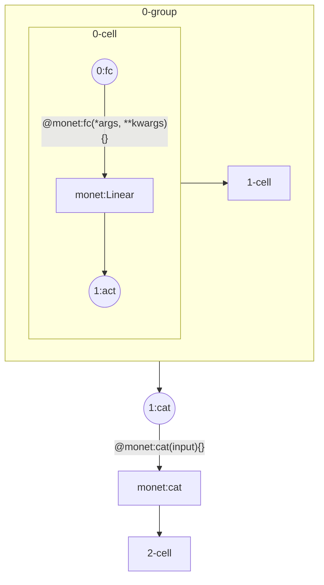

```mermaid
flowchart TB
subgraph 2567378580384[0-group]
  subgraph 2567378579856[0-cell]
    2567378949920((0:fc)) -- @monet:fc(*args, **kwargs){} --> 2567378945600[monet:Linear]
    --> 2567378950208((1:act))
  end
  2567378579856
  --> 2567378583264[1-cell]
end
2567378580384
--> 2567378956208((1:cat))
2567378956208((1:cat)) -- @monet:cat(input){} --> 2567378647312[monet:cat]
--> 2567378580000[2-cell]
```